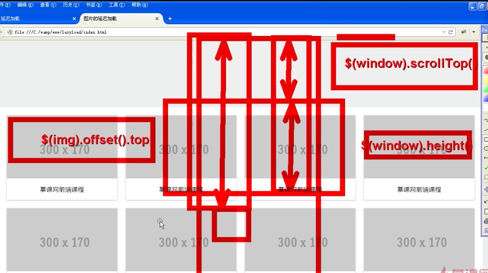
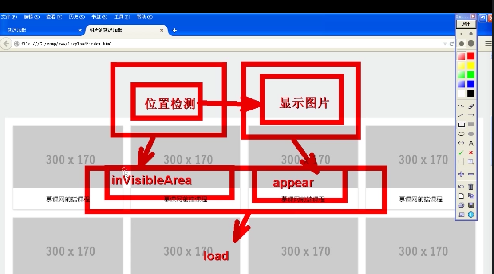

# jquery-lazyload
jquery实现懒加载的插件

使用方法：
```
    $('.lazy').lazyload();
```

可以接受参数 用来覆盖默认值；<br>
暂时可以修改的默认值为    
```
LazyLoad.DEFAULTS = {
        dataAttr: 'src'
    };
```

将图片的src存储在data数据中<br>


### 关于插件的问题

1.判断图片是否进入了可视区域的问题<br>
下面这张图可以解释
<br>

和这张图
 <br>

2.关于$.grep方法 <br>

$.grep() 函数使用指定的函数过滤数组中的元素，并返回过滤后的数组。


3.关于扩展的问题 <br>
如果这样使用插件$.each --> 那么使用$.extend定义插件 <br>
$().each -->  使用 $.fn.extend  这里我们要使用$(img).lazyLoad


[click!](https://kuronekonyaa.github.io/jquery-lazyload/)
